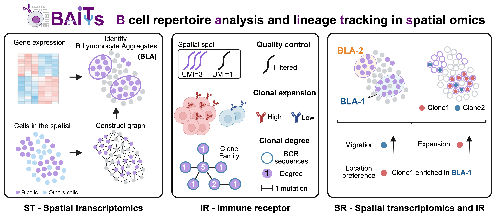

# BAITS

**B cell repertoire analysis and lineage tracking in spatial omics**




## Background

  B cell Hub Identification and B cell Tracking by BCR


## Features


## Getting started


## Installation


1. Create a conda or pyenv environment
```bash
conda create --name BAITS python=3.10
```
2. pip install BAITS
```bash
conda activate BAITS
pip install BAITS
```

## Contribution

